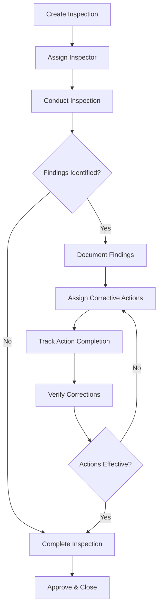
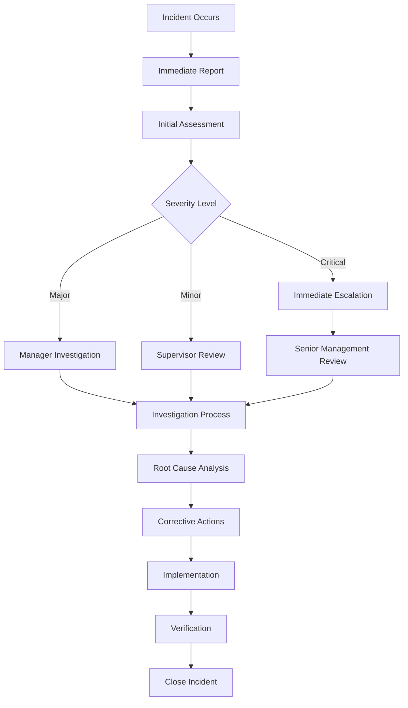
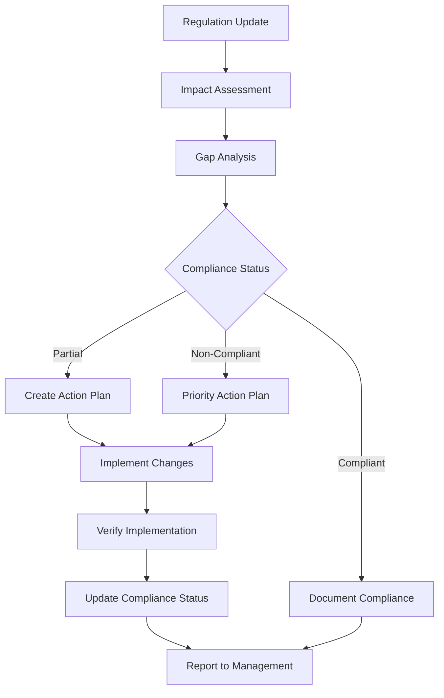
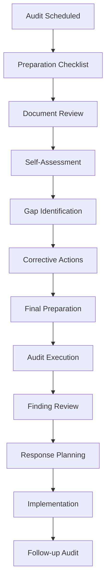

# SafetyHub Morocco - Product Requirements Document (PRD)
**Version 1.0 | January 2025**

---

## Table of Contents

1. [Executive Summary](#executive-summary)
2. [Feature Area Descriptions](#feature-area-descriptions)
3. [Workflows](#workflows)
4. [Architecture](#architecture)
5. [User Experience (UX)](#user-experience-ux)
6. [Database Schema](#database-schema)
7. [Compliance Mapping](#compliance-mapping)
8. [Reporting Framework](#reporting-framework)
9. [User Permissions](#user-permissions)
10. [Non-Functional Requirements](#non-functional-requirements)

---

## Executive Summary

### Platform Overview

SafetyHub Morocco is a comprehensive safety and compliance management platform designed specifically for Moroccan hospitality establishments. The platform ensures adherence to ONSSA (Office National de Sécurité Sanitaire des Produits Alimentaires), Labour Code, and other regulatory requirements through a multilingual, role-based system.

### Key Value Propositions

- **Regulatory Compliance**: Complete alignment with Moroccan food safety and hospitality regulations
- **Multilingual Support**: Native support for Arabic (RTL), French, and English
- **Role-Based Access**: Hierarchical permissions system (CEO → Manager → User)
- **Real-Time Analytics**: HACCP performance tracking and ONSSA compliance monitoring
- **Workflow Automation**: Streamlined safety inspection and audit processes
- **Multi-Site Management**: Centralized control across multiple hospitality locations

### Target Market

- **Primary**: Moroccan hospitality establishments (hotels, restaurants, cafés)
- **Secondary**: Multi-national hospitality chains with Moroccan operations
- **Tertiary**: Food service providers and catering companies

### Success Metrics

- **Compliance Rate**: 95%+ ONSSA compliance across all sites
- **User Adoption**: 90%+ active user engagement within 30 days
- **Incident Reduction**: 40% decrease in safety incidents within 6 months
- **Audit Efficiency**: 60% reduction in audit preparation time

---

## Feature Area Descriptions

### 1. Core Operations

#### 1.1 HACCP Management
**Purpose**: Hazard Analysis and Critical Control Points monitoring and compliance

**Key Features**:
- Critical Control Point (CCP) definition and monitoring
- Real-time temperature logging with automated alerts
- Corrective action tracking and documentation
- Verification and validation procedures
- Supplier verification and monitoring

**User Stories**:
- As a site manager, I can define CCPs for my kitchen operations
- As a user, I can log temperature readings with automatic threshold alerts
- As a CEO, I can view HACCP performance across all sites

#### 1.2 Audits & Inspections
**Purpose**: Systematic evaluation of safety and compliance standards

**Key Features**:
- Customizable audit templates aligned with Moroccan regulations
- Mobile-friendly inspection checklists
- Photo and document attachment capabilities
- Finding categorization (critical, major, minor)
- Corrective action planning and tracking

**User Stories**:
- As an inspector, I can conduct audits using mobile-optimized forms
- As a manager, I can assign corrective actions with due dates
- As a user, I can upload photos as evidence during inspections

#### 1.3 Temperature Monitoring
**Purpose**: Continuous monitoring of food safety temperatures

**Key Features**:
- Equipment-specific temperature logging
- Automated alert thresholds
- Calibration record management
- Historical trend analysis
- Integration with IoT temperature sensors

**User Stories**:
- As a kitchen staff member, I can quickly log refrigerator temperatures
- As a manager, I receive immediate alerts for temperature violations
- As a CEO, I can analyze temperature trends across all locations

### 2. Risk & Safety Management

#### 2.1 Incident Management
**Purpose**: Comprehensive incident reporting and investigation

**Key Features**:
- Incident report forms (accidents, near-misses, food safety)
- Investigation workflow with witness statements
- Root cause analysis tools
- Preventive measure tracking
- Incident trend analysis

**User Stories**:
- As a staff member, I can report incidents immediately via mobile
- As a manager, I can investigate incidents with structured workflows
- As a CEO, I can identify incident patterns across sites

#### 2.2 Risk Assessments
**Purpose**: Proactive identification and mitigation of safety risks

**Key Features**:
- Risk register maintenance
- Risk assessment methodologies (likelihood × impact)
- Mitigation plan development
- Review scheduling and notifications
- Risk heat mapping

**User Stories**:
- As a safety officer, I can conduct comprehensive risk assessments
- As a manager, I can prioritize risks based on severity scores
- As a CEO, I can view enterprise risk dashboard

### 3. Compliance & Regulatory

#### 3.1 ONSSA Compliance
**Purpose**: Ensure adherence to Moroccan food safety regulations

**Key Features**:
- ONSSA regulation library and updates
- Compliance gap analysis
- Inspection preparation checklists
- Document management for certificates
- Regulatory change notifications

**User Stories**:
- As a compliance officer, I can track ONSSA regulation changes
- As a manager, I can prepare for ONSSA inspections efficiently
- As a CEO, I can monitor compliance status across all sites

#### 3.2 Regulatory Alignment
**Purpose**: Maintain alignment with multiple Moroccan regulatory frameworks

**Key Features**:
- Multi-regulatory framework support (ONSSA, Labour Code, Municipal)
- Compliance matrix mapping
- Document version control
- Audit trail for compliance activities
- Regulatory reporting automation

**User Stories**:
- As a legal officer, I can map requirements across regulations
- As a manager, I can generate compliance reports for authorities
- As a CEO, I can ensure regulatory alignment across operations

### 4. Analytics & Reporting

#### 4.1 Performance Analytics
**Purpose**: Data-driven insights for safety and compliance performance

**Key Features**:
- HACCP performance dashboards
- ONSSA compliance scoring
- Multi-site comparison analytics
- Trend analysis and forecasting
- Custom KPI tracking

**User Stories**:
- As a CEO, I can compare performance across all sites
- As a manager, I can identify improvement opportunities
- As an analyst, I can generate custom performance reports

#### 4.2 Export & Reporting
**Purpose**: Comprehensive reporting capabilities for various stakeholders

**Key Features**:
- Multi-format export (PDF, Excel, CSV)
- Automated report generation
- Custom report builder
- Scheduled report delivery
- Multilingual report support

**User Stories**:
- As a manager, I can export audit reports for authorities
- As a CEO, I can receive automated weekly compliance reports
- As a compliance officer, I can create custom regulatory reports

---

## Workflows

### 1. Safety Inspection Workflow



### 2. Incident Management Workflow



### 3. ONSSA Compliance Workflow



### 4. Audit Preparation Workflow



---

## Architecture

### 1. System Architecture

```
┌─────────────────┐    ┌─────────────────┐    ┌─────────────────┐
│   Presentation  │    │    Business     │    │      Data       │
│      Layer      │    │     Logic       │    │      Layer      │
├─────────────────┤    ├─────────────────┤    ├─────────────────┤
│ • React Frontend│    │ • Service Layer │    │ • Database      │
│ • Mobile App    │◄──►│ • API Gateway   │◄──►│ • File Storage  │
│ • Admin Portal  │    │ • Auth Service  │    │ • Cache Layer   │
└─────────────────┘    └─────────────────┘    └─────────────────┘
```

### 2. Technology Stack

#### Frontend
- **Framework**: React 18 with Vite
- **UI Library**: Tailwind CSS with custom components
- **State Management**: Redux Toolkit
- **Routing**: React Router DOM
- **Internationalization**: Custom hooks for multilingual support

#### Backend
- **Runtime**: Edge Functions (Serverless)
- **Database**: PostgreSQL via ApperClient
- **Authentication**: ApperUI with role-based access
- **File Storage**: Integrated file management system
- **API**: RESTful services with ApperClient integration

#### Infrastructure
- **Deployment**: Cloud-native architecture
- **CDN**: Global content delivery
- **Monitoring**: Real-time performance tracking
- **Backup**: Automated data backup and recovery

### 3. Data Flow Architecture

```
User Interface → Authentication → Role Verification → Service Layer → Database
     ↑                                                        ↓
     └── Response with filtered data based on user role ──────┘
```

### 4. Security Architecture

- **Authentication**: Multi-factor authentication support
- **Authorization**: Role-based access control (RBAC)
- **Data Encryption**: End-to-end encryption for sensitive data
- **Audit Trail**: Complete activity logging and tracking
- **Compliance**: GDPR and Moroccan data protection compliance

### 5. Integration Architecture

```
┌─────────────────┐    ┌─────────────────┐    ┌─────────────────┐
│   External      │    │   SafetyHub     │    │    Internal     │
│   Systems       │    │   Morocco       │    │    Systems      │
├─────────────────┤    ├─────────────────┤    ├─────────────────┤
│ • ONSSA Portal  │◄──►│ • API Gateway   │◄──►│ • IoT Sensors   │
│ • Gov Systems   │    │ • Integration   │    │ • ERP Systems   │
│ • Third-party   │    │ • Hub           │    │ • HR Systems    │
└─────────────────┘    └─────────────────┘    └─────────────────┘
```

---

## User Experience (UX)

### 1. Design Principles

#### Accessibility First
- WCAG 2.1 AA compliance
- Keyboard navigation support
- Screen reader compatibility
- High contrast mode support

#### Multilingual & Cultural
- Right-to-left (RTL) support for Arabic
- Cultural color considerations
- Localized date and number formats
- Context-aware translations

#### Mobile-First
- Responsive design across all devices
- Touch-optimized interfaces
- Offline capability for critical functions
- Progressive Web App (PWA) features

### 2. Navigation Structure

```
Dashboard (Role-based landing)
├── Analytics & Reporting
│   ├── HACCP Analytics
│   ├── ONSSA Compliance
│   ├── Multi-Site Comparison
│   └── Incident Analysis
├── Core Operations
│   ├── Audits
│   ├── Checklists
│   ├── Temperature Records
│   └── HACCP Management
├── Risk & Safety Management
│   ├── Incidents
│   ├── Risk Assessments
│   ├── Chemical Safety
│   └── Property Inspections
├── Compliance & Regulatory
│   ├── ONSSA Compliance
│   ├── Regulatory Alignment
│   ├── Document Management
│   └── Certification Tracking
├── Management & Administration
│   ├── Companies (CEO only)
│   ├── Sites
│   ├── Users
│   ├── Workflows
│   └── Settings
└── Knowledge & Training
    ├── Training Dashboard
    ├── Document Centre
    ├── Safety Policies
    └── Resources Centre
```

### 3. User Interface Patterns

#### Dashboard Layout
- **Header**: Breadcrumb navigation, language selector, user profile
- **Sidebar**: Collapsible navigation with role-based filtering
- **Main Content**: Responsive card-based layout
- **Quick Actions**: Context-sensitive action buttons

#### Data Visualization
- **Charts**: ApexCharts for performance analytics
- **KPIs**: Large, easy-to-read metric cards
- **Trends**: Color-coded trend indicators
- **Status**: Badge-based status visualization

#### Forms & Input
- **Validation**: Real-time input validation
- **File Upload**: Drag-and-drop file handling
- **Auto-save**: Automatic form saving
- **Wizard**: Multi-step form processes

### 4. Responsive Breakpoints

- **Mobile**: ≤ 767px (Single column, touch-optimized)
- **Tablet**: 768px - 1023px (2-3 columns, hybrid interface)
- **Desktop**: ≥ 1024px (Full sidebar, multi-column layouts)

---

## Database Schema

### 1. Core Entities

#### Companies
```sql
company_c {
  Id_c: INTEGER PRIMARY KEY
  nameEn_c: TEXT
  nameAr_c: TEXT  
  nameFr_c: TEXT
  primaryLanguage_c: ENUM(en, ar, fr)
  status_c: ENUM(active, inactive, pending)
  Owner_c: LOOKUP
  CreatedOn: DATETIME
  ModifiedOn: DATETIME
}
```

#### Sites
```sql
site_c {
  Id_c: INTEGER PRIMARY KEY
  nameEn_c: TEXT
  nameAr_c: TEXT
  nameFr_c: TEXT
  city_c: TEXT
  address_c: MULTILINE_TEXT
  status_c: ENUM(active, inactive, maintenance)
  companyId_c: LOOKUP → company_c
  managerId_c: LOOKUP → user_c
  Owner_c: LOOKUP
  CreatedOn: DATETIME
  ModifiedOn: DATETIME
}
```

#### Users
```sql
user_c {
  Id_c: INTEGER PRIMARY KEY
  email_c: EMAIL
  fullNameEn_c: TEXT
  fullNameAr_c: TEXT
  fullNameFr_c: TEXT
  preferredLanguage_c: ENUM(en, ar, fr)
  status_c: ENUM(active, inactive, invited, pending)
  lastLoginAt_c: DATETIME
  siteId_c: LOOKUP → site_c
  roleId_c: LOOKUP → role_c
  Owner_c: LOOKUP
  CreatedOn: DATETIME
  ModifiedOn: DATETIME
}
```

#### Roles
```sql
role_c {
  Id_c: INTEGER PRIMARY KEY
  nameEn_c: TEXT
  nameAr_c: TEXT
  nameFr_c: TEXT
  code_c: TEXT
  scopeLevel_c: ENUM(company, site, global)
  isSystemRole_c: BOOLEAN
  Owner_c: LOOKUP
  CreatedOn: DATETIME
  ModifiedOn: DATETIME
}
```

### 2. Feature Area Entities

#### Feature Areas
```sql
feature_area_c {
  Id: INTEGER PRIMARY KEY
  Name: TEXT
  feature_area_c: TEXT
  relevant_moroccan_laws_c: MULTILINE_TEXT
  compliance_objectives_c: MULTILINE_TEXT
  obligatory_records_c: MULTILINE_TEXT
  record_retention_requirements_c: MULTILINE_TEXT
  inspection_needs_c: MULTILINE_TEXT
  reporting_obligations_c: MULTILINE_TEXT
  CreatedOn: DATETIME
  ModifiedOn: DATETIME
}
```

#### Regulatory Alignment
```sql
regulatory_alignment_c {
  Id: INTEGER PRIMARY KEY
  Name: TEXT
  feature_area_c: TEXT
  relevant_moroccan_laws_c: MULTILINE_TEXT
  compliance_objectives_c: MULTILINE_TEXT
  obligatory_records_c: MULTILINE_TEXT
  record_retention_requirements_c: MULTILINE_TEXT
  inspection_needs_c: MULTILINE_TEXT
  reporting_obligations_c: MULTILINE_TEXT
  CreatedOn: DATETIME
  ModifiedOn: DATETIME
}
```

### 3. Operational Entities

#### Workflows
```sql
workflow_c {
  Id: INTEGER PRIMARY KEY
  titleEn_c: TEXT
  titleAr_c: TEXT
  titleFr_c: TEXT
  descriptionEn_c: MULTILINE_TEXT
  descriptionAr_c: MULTILINE_TEXT
  descriptionFr_c: MULTILINE_TEXT
  type_c: ENUM(safety_inspection, fire_safety, equipment_check, compliance_audit, incident_report)
  priority_c: ENUM(low, medium, high, critical)
  status_c: ENUM(draft, assigned, in_progress, completed, approved, rejected)
  assignedTo_c: LOOKUP → user_c
  siteId_c: LOOKUP → site_c
  dueDate_c: DATETIME
  createdBy_c: LOOKUP → user_c
  createdAt_c: DATETIME
  completedAt_c: DATETIME
  approvedAt_c: DATETIME
}
```

#### Workflow Approvals
```sql
workflow_approval_c {
  Id: INTEGER PRIMARY KEY
  workflowId_c: LOOKUP → workflow_c
  approver_c: LOOKUP → user_c
  status_c: ENUM(pending, approved, rejected)
  comments_c: MULTILINE_TEXT
  approvedAt_c: DATETIME
  CreatedOn: DATETIME
}
```

#### Workflow Attachments
```sql
workflow_attachment_c {
  Id: INTEGER PRIMARY KEY
  workflowId_c: LOOKUP → workflow_c
  fileName_c: TEXT
  filePath_c: TEXT
  fileSize_c: INTEGER
  mimeType_c: TEXT
  uploadedBy_c: LOOKUP → user_c
  CreatedOn: DATETIME
}
```

### 4. Permission System

#### Permissions Matrix
```sql
permission_c {
  Id: INTEGER PRIMARY KEY
  roleId_c: LOOKUP → role_c
  resource_c: TEXT
  action_c: ENUM(create, read, update, delete)
  scope_c: ENUM(own, site, company, all)
  conditions_c: JSON
}
```

### 5. Data Relationships

```
company_c (1) ──────────── (n) site_c
    │                           │
    │                           │
    └── (n) user_c ─────────────┘
              │
              └── (n) workflow_c
                      │
                      ├── (n) workflow_approval_c
                      └── (n) workflow_attachment_c
```

---

## Compliance Mapping

### 1. ONSSA Regulations

#### Food Safety Requirements
```yaml
ONSSA_Food_Safety:
  regulations:
    - Food Handler Certification
    - Temperature Control Requirements
    - Hygiene Standards
    - Supplier Verification
    - Traceability Systems
  
  monitoring:
    - Daily temperature logs
    - Cleaning schedules
    - Supplier audits
    - Product recalls
    - Customer complaints
  
  documentation:
    - HACCP plans
    - Training records
    - Calibration certificates
    - Corrective action logs
    - Verification reports
```

#### Inspection Preparedness
```yaml
ONSSA_Inspection:
  preparation_checklist:
    - Current licenses and permits
    - Training certificates
    - Temperature monitoring records
    - Cleaning and sanitization logs
    - Supplier qualification documents
    - Corrective action records
    - Management system documentation
  
  compliance_scoring:
    - Critical violations: 0 tolerance
    - Major violations: < 5%
    - Minor violations: < 10%
    - Overall compliance: > 95%
```

### 2. Moroccan Labour Code

#### Worker Safety Requirements
```yaml
Labour_Code_Safety:
  requirements:
    - Workplace safety training
    - Personal protective equipment
    - Emergency procedures
    - Incident reporting
    - Health surveillance
    - Safety committee formation
  
  documentation:
    - Safety training records
    - Incident reports
    - Safety meeting minutes
    - Risk assessments
    - Emergency response plans
    - Medical surveillance records
```

#### Working Conditions
```yaml
Labour_Code_Conditions:
  standards:
    - Working hours compliance
    - Rest period requirements
    - Workplace environment
    - Equipment safety
    - Chemical handling
    - Fire safety measures
  
  monitoring:
    - Daily attendance records
    - Environmental monitoring
    - Equipment inspections
    - Chemical inventories
    - Fire drill records
    - Safety audit reports
```

### 3. Municipal Regulations

#### Building Safety
```yaml
Municipal_Building:
  requirements:
    - Fire safety compliance
    - Emergency exits
    - Ventilation systems
    - Electrical safety
    - Structural integrity
    - Accessibility compliance
  
  certificates:
    - Fire safety certificate
    - Building permit
    - Electrical certificate
    - Ventilation certificate
    - Accessibility certificate
    - Operating license
```

#### Public Health
```yaml
Municipal_Health:
  standards:
    - Water quality testing
    - Waste management
    - Pest control
    - Noise level compliance
    - Air quality monitoring
    - Public area hygiene
  
  records:
    - Water test reports
    - Waste disposal logs
    - Pest control reports
    - Noise measurements
    - Air quality reports
    - Cleaning schedules
```

### 4. Compliance Mapping Matrix

| Regulation Category | ONSSA | Labour Code | Municipal | Feature Area Coverage |
|-------------------|-------|-------------|-----------|---------------------|
| **Food Safety** | Primary | Secondary | Tertiary | HACCP Management |
| **Worker Safety** | Secondary | Primary | Secondary | Risk Management |
| **Building Safety** | Tertiary | Secondary | Primary | Property Inspections |
| **Environmental** | Secondary | Tertiary | Primary | Chemical Safety |
| **Documentation** | Primary | Primary | Primary | Document Management |
| **Training** | Primary | Primary | Secondary | Knowledge Center |

### 5. Regulatory Change Management

```yaml
Change_Management:
  monitoring:
    - Regulatory update subscriptions
    - Legal counsel notifications
    - Industry association updates
    - Government portal monitoring
  
  assessment:
    - Impact analysis workflow
    - Gap identification process
    - Timeline assessment
    - Resource requirement analysis
  
  implementation:
    - Change management workflow
    - Training update procedures
    - Documentation revision process
    - Compliance verification steps
  
  communication:
    - Stakeholder notification
    - Training program updates
    - Procedure modifications
    - System configuration changes
```

---

## Reporting Framework

### 1. Executive Reporting

#### CEO Dashboard Metrics
```yaml
Executive_Metrics:
  compliance_overview:
    - Overall compliance score
    - ONSSA readiness percentage
    - Critical findings count
    - Corrective action status
  
  performance_indicators:
    - Site performance comparison
    - Incident trend analysis
    - Training completion rates
    - Audit efficiency metrics
  
  risk_management:
    - High-risk area identification
    - Incident frequency analysis
    - Corrective action effectiveness
    - Regulatory change impact
```

#### Monthly Executive Report
```yaml
Monthly_Report:
  sections:
    - Executive Summary
    - Compliance Status Overview
    - Site Performance Analysis
    - Incident Summary and Trends
    - Regulatory Update Impact
    - Action Items and Priorities
  
  format: PDF with charts and graphs
  language: User-preferred language
  distribution: Automated email delivery
```

### 2. Operational Reporting

#### Site Manager Reports
```yaml
Site_Reports:
  daily_operations:
    - Temperature monitoring summary
    - Checklist completion status
    - Active corrective actions
    - Staff training status
  
  weekly_analysis:
    - Compliance trend analysis
    - Incident report summary
    - Training progress update
    - Equipment status report
  
  monthly_assessment:
    - Site compliance scorecard
    - Performance benchmark comparison
    - Improvement recommendations
    - Resource requirement analysis
```

#### Audit Reports
```yaml
Audit_Reports:
  inspection_summary:
    - Audit scope and objectives
    - Findings by category
    - Compliance scoring
    - Corrective action plan
  
  follow_up_report:
    - Action completion status
    - Verification results
    - Outstanding issues
    - Next audit schedule
```

### 3. Compliance Reporting

#### ONSSA Compliance Reports
```yaml
ONSSA_Reports:
  readiness_assessment:
    - Regulation compliance matrix
    - Gap analysis summary
    - Preparation status
    - Required actions timeline
  
  inspection_preparation:
    - Document checklist status
    - Staff certification status
    - System compliance verification
    - Critical point monitoring
```

#### Regulatory Filing Reports
```yaml
Regulatory_Filing:
  quarterly_submissions:
    - Compliance certification
    - Incident summary report
    - Training completion report
    - Corrective action summary
  
  annual_assessments:
    - Comprehensive compliance review
    - Risk assessment update
    - Management system evaluation
    - Improvement plan submission
```

### 4. Analytics & Insights

#### Performance Analytics
```yaml
Analytics_Reports:
  trend_analysis:
    - Compliance score trends
    - Incident frequency patterns
    - Training effectiveness metrics
    - Corrective action efficiency
  
  predictive_insights:
    - Risk probability scoring
    - Compliance forecast modeling
    - Resource requirement prediction
    - Performance optimization recommendations
```

#### Multi-Site Comparison
```yaml
Comparison_Reports:
  performance_benchmarking:
    - Site-to-site comparison
    - Best practice identification
    - Performance ranking
    - Improvement opportunity analysis
  
  resource_optimization:
    - Resource utilization analysis
    - Cost-benefit assessment
    - Efficiency recommendations
    - Investment prioritization
```

### 5. Custom Reporting

#### Report Builder
```yaml
Custom_Reports:
  builder_features:
    - Drag-and-drop interface
    - Field selection tools
    - Filter and grouping options
    - Chart and graph integration
  
  export_options:
    - PDF with formatting
    - Excel with data tables
    - CSV for data analysis
    - PowerPoint presentation format
  
  scheduling:
    - Automated generation
    - Email distribution
    - Notification triggers
    - Archive management
```

#### API Reporting
```yaml
API_Integration:
  endpoints:
    - Real-time data access
    - Bulk data export
    - Custom query support
    - Webhook notifications
  
  formats:
    - JSON data structures
    - XML for legacy systems
    - CSV for spreadsheet import
    - PDF for presentation
```

---

## User Permissions

### 1. Role Hierarchy

```
CEO (Company Level)
├── Full system access
├── All sites and users
├── System configuration
└── Regulatory reporting

Manager (Site Level)
├── Site-specific access
├── Site user management
├── Local compliance
└── Site reporting

User (Operational Level)
├── Assigned task access
├── Personal data entry
├── Basic reporting
└── Training materials
```

### 2. Permission Matrix

#### Resource Access Control
| Resource | CEO | Manager | User | Description |
|----------|-----|---------|------|-------------|
| **Companies** | CRUD | Read | Read | Company information |
| **Sites** | CRUD | Update (own) | Read (assigned) | Site management |
| **Users** | CRUD | CRUD (site) | Read (own) | User management |
| **Workflows** | CRUD | CRUD (site) | Update (assigned) | Workflow management |
| **Audits** | Read All | CRUD (site) | Update (assigned) | Audit management |
| **Reports** | All Reports | Site Reports | Personal Reports | Reporting access |
| **Settings** | Full Access | Limited | None | System configuration |
| **Analytics** | Full Access | Site Analytics | Personal Analytics | Analytics access |

#### Functional Permissions
```yaml
CEO_Permissions:
  scope: company
  access:
    - create: [companies, sites, users, workflows, audits]
    - read: [all_resources]
    - update: [all_resources]
    - delete: [all_resources]
  restrictions: []

Manager_Permissions:
  scope: site
  access:
    - create: [users, workflows, audits]
    - read: [site_data, company_data]
    - update: [site_data, site_users, site_workflows]
    - delete: [site_workflows, site_audits]
  restrictions:
    - cannot_modify: [company_settings, other_sites]
    - cannot_delete: [users, critical_data]

User_Permissions:
  scope: own
  access:
    - create: [task_responses, incident_reports]
    - read: [assigned_tasks, training_materials, own_data]
    - update: [assigned_tasks, own_profile]
    - delete: []
  restrictions:
    - cannot_access: [other_user_data, site_settings, reports]
    - cannot_modify: [workflows, audit_templates]
```

### 3. Data Filtering Rules

#### CEO Access
```sql
-- CEOs see all data across all companies they own
SELECT * FROM sites WHERE companyId IN (
  SELECT Id FROM companies WHERE Owner = current_user_id
)
```

#### Manager Access
```sql
-- Managers see only their assigned site data
SELECT * FROM workflows WHERE siteId = (
  SELECT siteId FROM users WHERE Id = current_user_id
)
```

#### User Access
```sql
-- Users see only their assigned tasks and personal data
SELECT * FROM workflows WHERE assignedTo = current_user_id
```

### 4. Permission Inheritance

```yaml
Permission_Inheritance:
  company_level:
    - CEO permissions inherit to all owned companies
    - Company settings apply to all sites
    - Global policies cascade down
  
  site_level:
    - Manager permissions limited to assigned site
    - Site policies override company defaults
    - Local customizations allowed
  
  user_level:
    - User permissions are most restrictive
    - No inheritance to other users
    - Personal data access only
```

### 5. Dynamic Permissions

#### Conditional Access
```yaml
Conditional_Permissions:
  workflow_assignment:
    condition: user.Id == workflow.assignedTo
    permissions: [read, update]
    
  site_management:
    condition: user.siteId == site.Id AND user.role == 'manager'
    permissions: [read, update, create_workflows]
    
  emergency_access:
    condition: incident.severity == 'critical'
    permissions: [escalate, notify_all, override_normal_flow]
```

#### Time-Based Permissions
```yaml
Time_Based_Access:
  audit_windows:
    - permission: audit_creation
    - time_restriction: business_hours_only
    - override: emergency_incidents
  
  approval_deadlines:
    - permission: workflow_approval
    - time_limit: 48_hours
    - escalation: auto_approve_after_deadline
```

### 6. Permission Verification

#### Route-Based Protection
```javascript
// Route access verification
const verifyRouteAccess = (route, user) => {
  const routeConfig = getRouteConfig(route);
  return routeConfig.allow.when.conditions.every(condition => {
    return evaluateCondition(condition, user);
  });
};
```

#### API Endpoint Protection
```javascript
// API endpoint access control
const checkPermission = (resource, action, user) => {
  const userPermissions = getUserPermissions(user.roleId);
  return userPermissions.some(permission => 
    permission.resource === resource && 
    permission.action === action &&
    evaluateScope(permission.scope, user)
  );
};
```

### 7. Audit Trail

#### Permission Tracking
```yaml
Permission_Audit:
  tracked_events:
    - permission_granted
    - permission_revoked
    - access_attempted
    - access_denied
    - role_changed
    - scope_modified
  
  log_fields:
    - timestamp
    - user_id
    - resource
    - action
    - result
    - ip_address
    - user_agent
```

---

## Non-Functional Requirements

### 1. Performance Requirements

#### Response Times
```yaml
Performance_Targets:
  page_load:
    - dashboard: < 2 seconds
    - data_entry_forms: < 1.5 seconds
    - report_generation: < 5 seconds
    - mobile_interface: < 3 seconds
  
  api_response:
    - data_retrieval: < 500ms
    - data_updates: < 1 second
    - file_uploads: < 10 seconds (per 10MB)
    - bulk_operations: < 30 seconds
  
  database_performance:
    - query_execution: < 200ms (95th percentile)
    - concurrent_users: 1000+ simultaneous
    - transaction_throughput: 100+ TPS
```

#### Scalability
```yaml
Scalability_Requirements:
  user_capacity:
    - concurrent_users: 1000+
    - total_users: 10,000+
    - sites_supported: 500+
    - companies_supported: 100+
  
  data_volume:
    - database_size: 100GB+
    - file_storage: 1TB+
    - daily_transactions: 100,000+
    - annual_growth: 50%
  
  geographic_scaling:
    - morocco_nationwide: primary
    - mena_region: secondary
    - global_expansion: future
```

### 2. Security Requirements

#### Data Protection
```yaml
Security_Standards:
  encryption:
    - data_at_rest: AES-256
    - data_in_transit: TLS 1.3
    - database_encryption: transparent_data_encryption
    - file_storage: encrypted_at_rest
  
  authentication:
    - multi_factor_auth: supported
    - password_policy: enterprise_grade
    - session_management: secure_tokens
    - account_lockout: brute_force_protection
  
  access_control:
    - role_based_access: enforced
    - principle_of_least_privilege: applied
    - regular_access_reviews: quarterly
    - privileged_access_monitoring: continuous
```

#### Compliance & Privacy
```yaml
Privacy_Compliance:
  data_protection:
    - gdpr_compliance: full
    - moroccan_data_law: compliant
    - data_minimization: implemented
    - right_to_deletion: supported
  
  audit_requirements:
    - activity_logging: comprehensive
    - audit_trail: immutable
    - compliance_reporting: automated
    - forensic_capabilities: available
```

### 3. Reliability Requirements

#### Availability
```yaml
Availability_Targets:
  uptime:
    - system_availability: 99.9%
    - planned_maintenance: < 4 hours/month
    - emergency_maintenance: < 1 hour/month
    - disaster_recovery_time: < 4 hours
  
  fault_tolerance:
    - single_point_failure: eliminated
    - automatic_failover: < 30 seconds
    - data_backup: real_time_replication
    - geographic_redundancy: implemented
```

#### Disaster Recovery
```yaml
Disaster_Recovery:
  backup_strategy:
    - frequency: continuous_replication
    - retention: 7_years
    - testing: monthly_recovery_tests
    - geographic_distribution: multi_region
  
  recovery_objectives:
    - rto: 4 hours (recovery_time_objective)
    - rpo: 1 hour (recovery_point_objective)
    - data_loss_tolerance: minimal
    - business_continuity: maintained
```

### 4. Usability Requirements

#### User Experience
```yaml
Usability_Standards:
  accessibility:
    - wcag_compliance: AA_level
    - screen_reader_support: full
    - keyboard_navigation: complete
    - color_contrast: compliant
  
  multilingual_support:
    - languages: arabic_french_english
    - rtl_support: native_arabic
    - localization: cultural_adaptation
    - font_support: arabic_typography
  
  mobile_responsiveness:
    - device_support: ios_android_web
    - touch_optimization: finger_friendly
    - offline_capability: core_functions
    - sync_capability: automatic
```

#### Training & Support
```yaml
Training_Requirements:
  user_onboarding:
    - initial_training: 2_hours_maximum
    - role_specific_training: customized
    - interactive_tutorials: embedded
    - help_documentation: comprehensive
  
  ongoing_support:
    - help_system: contextual
    - video_tutorials: multilingual
    - user_community: moderated_forums
    - expert_support: available
```

### 5. Compatibility Requirements

#### Browser Support
```yaml
Browser_Compatibility:
  desktop_browsers:
    - chrome: latest_3_versions
    - firefox: latest_3_versions
    - safari: latest_2_versions
    - edge: latest_2_versions
  
  mobile_browsers:
    - chrome_mobile: latest_2_versions
    - safari_mobile: latest_2_versions
    - samsung_internet: latest_version
    - firefox_mobile: latest_version
```

#### Integration Requirements
```yaml
Integration_Standards:
  apis:
    - rest_api: comprehensive
    - webhook_support: real_time_notifications
    - bulk_import_export: csv_excel_json
    - third_party_integration: documented_apis
  
  standards_compliance:
    - http_rest: restful_design
    - json_schema: validated_payloads
    - oauth2: secure_authorization
    - openapi: documented_specifications
```

### 6. Maintenance Requirements

#### System Updates
```yaml
Maintenance_Standards:
  update_frequency:
    - security_patches: within_24_hours
    - feature_updates: monthly
    - major_releases: quarterly
    - regulatory_updates: as_required
  
  deployment_process:
    - zero_downtime_deployment: required
    - rollback_capability: automated
    - testing_pipeline: comprehensive
    - user_notification: advance_warning
```

#### Monitoring & Analytics
```yaml
Monitoring_Requirements:
  system_monitoring:
    - performance_metrics: real_time
    - error_tracking: automated_alerts
    - user_analytics: privacy_compliant
    - security_monitoring: continuous
  
  reporting:
    - system_health_dashboard: 24_7
    - performance_reports: weekly
    - security_reports: daily
    - business_metrics: real_time
```

### 7. Regulatory Compliance

#### Data Residency
```yaml
Data_Compliance:
  location_requirements:
    - primary_data_center: morocco
    - backup_location: mena_region
    - eu_data_processing: gdpr_compliant
    - cross_border_transfers: lawful_basis
  
  regulatory_adherence:
    - moroccan_data_protection: compliant
    - onssa_digital_requirements: met
    - labour_code_digital: supported
    - banking_regulations: if_applicable
```

#### Certification Requirements
```yaml
Certifications:
  security_certifications:
    - iso_27001: target_certification
    - soc2_type2: annual_audit
    - penetration_testing: quarterly
    - vulnerability_assessment: monthly
  
  compliance_audits:
    - internal_audits: quarterly
    - external_audits: annually
    - regulatory_reviews: as_required
    - certification_maintenance: ongoing
```

---

## Implementation Roadmap

### Phase 1: Foundation (Months 1-3)
- Core infrastructure setup
- User authentication and role management
- Basic company/site/user management
- Essential compliance framework

### Phase 2: Core Operations (Months 4-6)
- HACCP management system
- Audit and inspection workflows
- Temperature monitoring
- Basic reporting framework

### Phase 3: Advanced Features (Months 7-9)
- Advanced analytics and dashboards
- ONSSA compliance automation
- Multi-site comparison tools
- Mobile optimization

### Phase 4: Integration & Enhancement (Months 10-12)
- Third-party integrations
- Advanced workflow automation
- Predictive analytics
- Performance optimization

---

## Success Metrics & KPIs

### Business Metrics
- **User Adoption Rate**: 90% within 30 days
- **Compliance Score Improvement**: 25% increase in 6 months
- **Incident Reduction**: 40% decrease in safety incidents
- **Audit Preparation Time**: 60% reduction

### Technical Metrics
- **System Uptime**: 99.9% availability
- **Page Load Speed**: < 2 seconds average
- **User Satisfaction**: 4.5/5.0 rating
- **Data Accuracy**: 99.95% correctness

### Compliance Metrics
- **ONSSA Readiness**: 95%+ compliance score
- **Regulatory Updates**: 100% tracking coverage
- **Documentation Completeness**: 98%+ accuracy
- **Training Completion**: 95%+ staff certified

---

**Document Prepared By**: SafetyHub Morocco Development Team  
**Last Updated**: January 2025  
**Version**: 1.0  
**Next Review**: March 2025